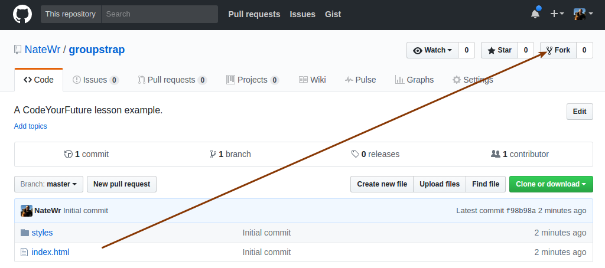
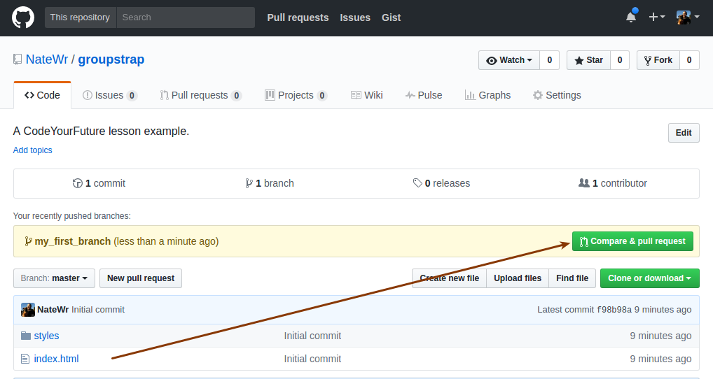

# Instructions

To complete the exercises for today's class, you'll need to fork this repository to your personal account.



Then clone the repository to your computer:

```
git clone git@github.com:<your_username>/groupstrap.git
```

Then make the following changes:

1. Create a new page named `<your_username>.html`.
2. Copy the contents of `index.html` to `<your_username>.html`.
3. Find the place where it says `<!-- Add your Bootstrap components here -->`.
4. Read about Bootstrap's [card component](https://v4-alpha.getbootstrap.com/components/card/). Then add two or three card components to your new page.

## Step 2: Branching and Pull Requests

Once we've done the group exercise on branching and pull requests with git, you'll need to create a branch, commit your changes and push them up to your repository:

1. `git checkout -b my_first_branch`
2. `git add .`
3. `git commit -m "Added my page to the project"`
4. `git push -u origin my_first_branch`

Once you've committed your branch, browse to the [original repository](https://github.com/NateWr/groupstrap) and issue a Pull Request.


